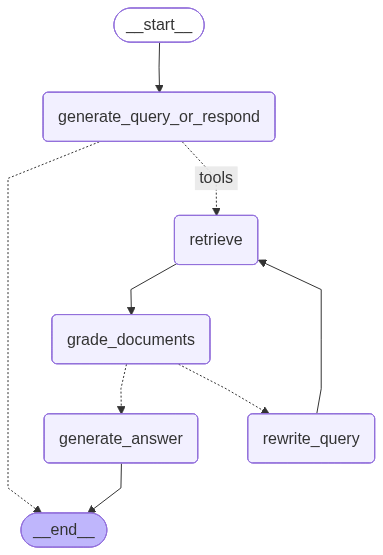

# 🧠 MultiModal Agentic RAG

**A Multimodal, Agentic RAG System for Intelligent Document Processing**


---

## 📘 Overview

The **MultiModal Agentic RAG** is designed to **intelligently process and retrieve information from complex, unstructured documents** by leveraging a **Retrieval-Augmented Generation (RAG)** pipeline with **multimodal (text, table, and image) understanding**.

It integrates advanced models for **document structure analysis, semantic chunking, and agentic reasoning**, enabling context-aware, explainable question answering.

This system is demonstrated using the **Oxford Textbook of Medicine (6th Edition)**, chosen for its diverse complexity including detailed tables, diagnostic diagrams, medical images, and multi-level content organization.

---

## 🎯 Project Goals

* **Convert** unstructured PDFs into structured and searchable formats (Markdown & JSON).
* **Preserve** document hierarchy, semantic relationships, and contextual information.
* **Analyze** multimodal content—text, tables, and diagnostic images—through specialized models.
* **Build** an intelligent retrieval system using RAG with hierarchical context preservation.
* **Enable** accurate conversational chatbot using information retrieved from text, tables, and images.
* **Implement** modular, maintainable system architecture following Clean Architecture principles.

---

## 🏗️ System Architecture

This project follows **Clean Architecture** to ensure high scalability, maintainability, and testability.
Dependencies flow **inward**—from frameworks toward the core business logic.

### Layers

| Layer                    | Description                                                                        |
| ------------------------ | ---------------------------------------------------------------------------------- |
| **Entities**             | Core data models and validation independent of frameworks.                         |
| **Use Cases**            | Implements the application’s business logic (indexing and inference pipelines) |
| **Interface Adapters**   | Bridges entities and external interfaces (e.g., APIs, vector stores).              |
| **Frameworks & Drivers** | Outer layer containing frameworks (PTB, GenAi, etc.).                 |

### Key Design Principles

* **Dependency Rule**: Inner layers never depend on outer layers.
* **Dependency Inversion**: Interfaces are defined at the core, implementations in outer layers.
* **Dependency Injection**: Managed via the `dependency-injector` library for modular configuration.

---

## 🧩 Core Components

### 🧱 1. Docling-Based Document Processing

The system uses **[Docling](https://github.com/IBM/Docling)**, an open-source library developed by IBM Research, to parse and structure  PDFs.

**Key Features of Prepared Indexing Pipeline:**

* Hierarchical structure recognition (titles, sections, paragraphs).
* Accurate table extraction via **TableFormer**.
* Layout analysis using **Heron (RT-DETR + ResNet-50)**.
* Optical Character Recognition (OCR) with **EasyOCR (CRAFT + CRNN)**.
* Image captioning with **Gemini 2.5-Flash** to enable content-based image retrieval.
For example, when text discusses a skin condition and includes a diagnostic image, the image description enables retrieval based on visual content, enriching responses with related diagnostic information.
* Intelligent contextual chunking that preserves semantic relations.
* Structured output in **Markdown** and **JSON** for downstream processing.

---

### 🧠 2. Agentic RAG System




The RAG system uses **LangGraph** to create an **agentic reasoning workflow**, where each node represents a step in the retrieval and generation process.

**Key Capabilities:**

* Intelligent decision-making to determine when to retrieve or directly answer.
* Context-aware document retrieval with **Elasticsearch**.
* Query rewriting for unanswerable or ambiguous questions.
* Answer generation with detailed source attribution.
* Visual grounding: retrieves and attaches related images and metadata to answers.
* Context preservation across dialogue sessions.

---

### 🖼️ 3. Multimodal Integration

The system supports multimodal inputs:

* **Text:** Paragraphs, summaries, and semantic relationships.
* **Tables:** Extracted with TableFormer and stored with relational metadata.
* **Images:** Described by Gemini 2.5-Flash and linked to related textual content.

Each chunk is semantically enriched with metadata (e.g., section, page number, caption, and hierarchy).

---

## 📚 References

* *Oxford Textbook of Medicine, 6th Edition*
* Docling: [https://github.com/IBM/Docling](https://github.com/IBM/Docling)
* LangGraph: [https://github.com/langchain-ai/langgraph](https://github.com/langchain-ai/langgraph)
* TableFormer, Heron, EasyOCR, Gemini 2.5-Flash documentation
* Comparison study: [Docling vs GPT-5](https://github.com/Alijanloo/MultiModalRag/tree/master/docs/compare%20docling%20with%20GPT-5)

---

## Quick Start

### Installation

```bash
uv pip install torch --index-url https://download.pytorch.org/whl/cpu
uv pip install -e .
```

### Launch

```bash
# Copy and customize configuration
cp config.yaml.example config.yaml
# Edit config.yaml with your API tokens and settings

# Run the application
python multimodal_rag
```
---

## 📄 License

This project is licensed under the MIT License .
