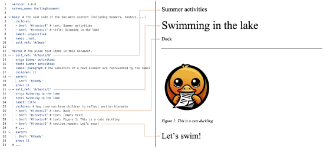
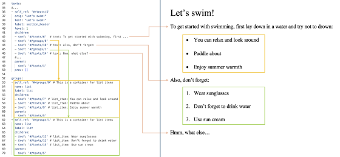

# Docling PDF Conversion Pipeline

Docling parses PDFs in stages rather than treating a whole page as one “black‐box” VLM call. First, a PDF **backend** (by default the custom *docling-parse* or *pypdfium2* library) extracts all text tokens with coordinates and renders each page to an image[\[1\]](https://ar5iv.labs.arxiv.org/html/2408.09869#:~:text=Docling%20implements%20a%20linear%20pipeline,the%20document%20language%2C%20infers%20reading). Then the **model pipeline** runs on each page independently: a layout analysis model (DocLayNet/Heron, based on RT-DETR) detects objects like paragraphs, section titles, list items, figures, and tables in the page image[\[2\]](https://ar5iv.labs.arxiv.org/html/2408.09869#:~:text=Our%20layout%20analysis%20model%20is,5)[\[3\]](https://ar5iv.labs.arxiv.org/html/2408.09869#:~:text=The%20Docling%20pipeline%20feeds%20page,items%2C%20captions%2C%20figures%20or%20tables). Overlapping boxes are filtered and each detected region is intersected with the PDF’s text tokens to assemble complete units: e.g. contiguous lines become a paragraph or list item, headers are identified, figure/table captions are linked, etc[\[3\]](https://ar5iv.labs.arxiv.org/html/2408.09869#:~:text=The%20Docling%20pipeline%20feeds%20page,items%2C%20captions%2C%20figures%20or%20tables). In short, Docling *does not* feed the whole page into one VLM; it uses specialized computer-vision models for layout and tables. (Optional OCR can also run on the page image – e.g. EasyOCR at high resolution – to transcribe any scanned text[\[4\]](https://ar5iv.labs.arxiv.org/html/2408.09869#:~:text=).)

If a detected region is classified as a table, Docling crops that table and runs the **TableFormer** model on its image plus the table’s text grid. TableFormer is a transformer trained to recover table rows, columns, and cell spans[\[5\]](https://ar5iv.labs.arxiv.org/html/2408.09869#:~:text=The%20TableFormer%20model%C2%A0,inference%2C%20our%20implementation%20relies%20on). Its output (row/column indices for each cell) is then mapped back onto the original PDF cells to build a structured table object[\[6\]](https://ar5iv.labs.arxiv.org/html/2408.09869#:~:text=The%20Docling%20pipeline%20feeds%20all,be%20processed%20on%20a%20standard). Figures or pictures (detected as “Picture” by the layout model) can optionally be classified or described by a VLM (e.g. the IBM Granite model) if the pipeline is configured for picture annotation – but again, this operates on the extracted image alone, not the full text layout.

After per-page modeling, Docling applies a **reading-order and assembly** stage. A learned *ReadingOrderModel* sorts all page elements into natural order and identifies relationships (e.g. which caption goes with which figure). The pipeline then **builds a DoclingDocument** by iterating through these elements in order and calling the Docling API (e.g. add\_heading, add\_text, add\_list\_item, add\_table, add\_picture, etc.) to attach each item into the document tree[\[7\]](https://ar5iv.labs.arxiv.org/html/2408.09869#:~:text=3). This ensures a consistent hierarchy: for example, once a section header is added, subsequent paragraphs become its children, and contiguous list items create a list-group node. All content (texts, tables, pictures, etc.) is stored in flat lists, while the **body** field holds the root of the hierarchical tree and a separate groups list holds container nodes (like list or chapter groups)[\[8\]](https://docling-project.github.io/docling/concepts/docling_document/#:~:text=All%20of%20the%20above%20fields,and%20children%20through%20JSON%20pointers). In this way, every new element is linked by JSON-pointer references into the existing tree. As the Docling docs illustrate, all items on a page end up nested under their section header in the body tree[\[9\]](https://docling-project.github.io/docling/concepts/docling_document/#:~:text=Below%20example%20shows%20how%20all,texts%2F1), and list items are collected under a parent “list” node in the groups section[\[10\]](https://docling-project.github.io/docling/concepts/docling_document/#:~:text=Grouping).

  
*Figure: Example DoclingDocument structure from the Docling docs. The right side shows a page with headings (“Swimming in the lake”, “Let’s swim\!”), an image and caption, and paragraphs. The left YAML shows the document tree: a root body node, under which text items (with their labels and pointers) are nested. For instance, “Swimming in the lake” is a section\_header with its child list item and caption, and these relationships are maintained via pointers[\[9\]](https://docling-project.github.io/docling/concepts/docling_document/#:~:text=Below%20example%20shows%20how%20all,texts%2F1).*

*Figure: Nested lists and groups in a DoclingDocument. Under the heading “Let’s swim\!”, two lists (one bullet, one numbered) are shown on the right. The left YAML shows each list’s group (\# /groups/0 and \# /groups/1) containing their list\_item children. This demonstrates how Docling groups contiguous list items into a List container node, preserving hierarchy[\[10\]](https://docling-project.github.io/docling/concepts/docling_document/#:~:text=Grouping).*

In summary, Docling’s PDF pipeline is a sequence of specialized analyses (layout detection, table recovery, OCR, etc.) followed by a reading-order assembly into a typed document model[\[1\]](https://ar5iv.labs.arxiv.org/html/2408.09869#:~:text=Docling%20implements%20a%20linear%20pipeline,the%20document%20language%2C%20infers%20reading)[\[7\]](https://ar5iv.labs.arxiv.org/html/2408.09869#:~:text=3). It **does not** simply dump the page into one large VLM; instead it incrementally builds the structure using bounding boxes, token intersection, and the DoclingDocument API. The final result is a rich JSON/Markdown document where each element is placed in the correct tree position with consistent parent/child pointers[\[7\]](https://ar5iv.labs.arxiv.org/html/2408.09869#:~:text=3)[\[8\]](https://docling-project.github.io/docling/concepts/docling_document/#:~:text=All%20of%20the%20above%20fields,and%20children%20through%20JSON%20pointers).

**Sources:** Official Docling docs and technical report describe this pipeline. For example, the Docling technical report explains that each PDF is parsed to text tokens and images, then a layout model and a table model run on each page, followed by post-processing into a DoclingDocument[\[1\]](https://ar5iv.labs.arxiv.org/html/2408.09869#:~:text=Docling%20implements%20a%20linear%20pipeline,the%20document%20language%2C%20infers%20reading)[\[3\]](https://ar5iv.labs.arxiv.org/html/2408.09869#:~:text=The%20Docling%20pipeline%20feeds%20page,items%2C%20captions%2C%20figures%20or%20tables)[\[6\]](https://ar5iv.labs.arxiv.org/html/2408.09869#:~:text=The%20Docling%20pipeline%20feeds%20all,be%20processed%20on%20a%20standard)[\[8\]](https://docling-project.github.io/docling/concepts/docling_document/#:~:text=All%20of%20the%20above%20fields,and%20children%20through%20JSON%20pointers). These sources detail how Docling detects elements and constructs the document tree.

---

[\[1\]](https://ar5iv.labs.arxiv.org/html/2408.09869#:~:text=Docling%20implements%20a%20linear%20pipeline,the%20document%20language%2C%20infers%20reading) [\[2\]](https://ar5iv.labs.arxiv.org/html/2408.09869#:~:text=Our%20layout%20analysis%20model%20is,5) [\[3\]](https://ar5iv.labs.arxiv.org/html/2408.09869#:~:text=The%20Docling%20pipeline%20feeds%20page,items%2C%20captions%2C%20figures%20or%20tables) [\[4\]](https://ar5iv.labs.arxiv.org/html/2408.09869#:~:text=) [\[5\]](https://ar5iv.labs.arxiv.org/html/2408.09869#:~:text=The%20TableFormer%20model%C2%A0,inference%2C%20our%20implementation%20relies%20on) [\[6\]](https://ar5iv.labs.arxiv.org/html/2408.09869#:~:text=The%20Docling%20pipeline%20feeds%20all,be%20processed%20on%20a%20standard) [\[7\]](https://ar5iv.labs.arxiv.org/html/2408.09869#:~:text=3) \[2408.09869\] Docling Technical Report

[https://ar5iv.labs.arxiv.org/html/2408.09869](https://ar5iv.labs.arxiv.org/html/2408.09869)

[\[8\]](https://docling-project.github.io/docling/concepts/docling_document/#:~:text=All%20of%20the%20above%20fields,and%20children%20through%20JSON%20pointers) [\[9\]](https://docling-project.github.io/docling/concepts/docling_document/#:~:text=Below%20example%20shows%20how%20all,texts%2F1) [\[10\]](https://docling-project.github.io/docling/concepts/docling_document/#:~:text=Grouping) Docling Document \- Docling

[https://docling-project.github.io/docling/concepts/docling\_document/](https://docling-project.github.io/docling/concepts/docling_document/)
